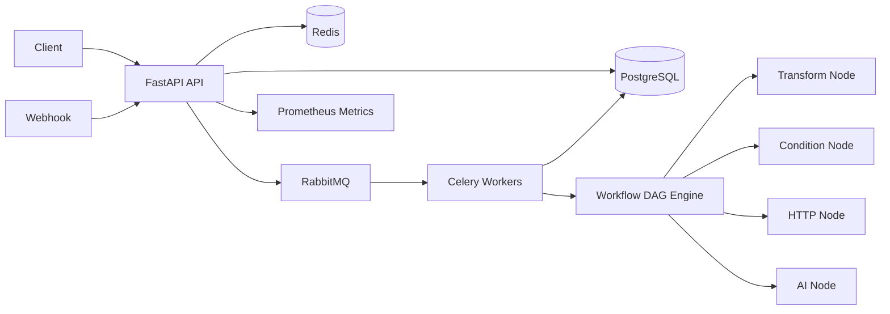

# FlowForge AI

**FlowForge AI** is a production-style, multi-tenant workflow automation backend inspired by systems such as Zapier and n8n.

It is intentionally built as a distributed backend portfolio project: workflows are immutable/versioned DAGs, executions run asynchronously in Celery workers, webhook delivery is idempotent, organizations are isolated through RBAC, secrets are encrypted, changes are audited, and the service exposes health/readiness and Prometheus metrics.

## What it demonstrates

- FastAPI REST backend
- PostgreSQL + async SQLAlchemy
- Alembic migrations
- Multi-tenancy
- JWT authentication
- Organization-level RBAC: owner / admin / member
- Immutable workflow versioning
- DAG validation with cycle detection
- Background execution through Celery + RabbitMQ
- Redis-backed idempotency
- Retry + exponential backoff at node level
- Manual and webhook workflow triggers
- Transform, condition, HTTP and AI workflow nodes
- Conditional branching
- Encrypted organization secrets
- Audit trail
- Execution and per-node step history
- Prometheus metrics
- Liveness / readiness probes
- Docker Compose
- Kubernetes deployment example
- Unit + PostgreSQL + Redis integration tests
- GitHub Actions CI

## Architecture



## Execution model

A workflow definition is a DAG:

```text
transform
    ↓
condition
   ↙   ↘
true   false
 ↓       ↓
 AI     HTTP
```

A new version is created every time the definition changes. Existing executions keep referencing the exact version they started with, so editing a workflow cannot silently alter an in-flight or historical execution.

When execution starts:

1. API creates an `Execution` row with status `queued`.
2. Celery sends the execution ID through RabbitMQ.
3. A worker loads the immutable workflow version.
4. The DAG validator calculates a topological execution order.
5. Each node is executed with optional retries and exponential backoff.
6. Condition nodes choose branches through edge `when` values.
7. Per-node results are written as `ExecutionStep` records.
8. Final execution status and output are persisted.

## Idempotent webhooks

Webhook requests accept an `Idempotency-Key` header.

Redis uses an atomic `SET NX` claim so repeated delivery cannot enqueue the same event multiple times. PostgreSQL also has a unique constraint on `workflow_id + idempotency_key` as a durable second line of defense.

## Security model

- Passwords use Argon2 through `pwdlib`.
- API authentication uses signed JWT access tokens.
- Every organization resource checks membership and role.
- Stored organization secrets are encrypted with Fernet.
- Secret values are never returned from list/create responses.
- Audit records capture important organization mutations.

## Node types

### Transform

Creates values using context templates:

```json
{
  "id": "prepare",
  "type": "transform",
  "config": {
    "set": {
      "customer": "{{input.customer}}",
      "score": "{{input.score}}"
    }
  }
}
```

### Condition

```json
{
  "id": "is_priority",
  "type": "condition",
  "config": {
    "path": "input.score",
    "operator": "gte",
    "value": 80
  }
}
```

Supported operators:

`eq` · `ne` · `gt` · `gte` · `lt` · `lte` · `contains`

### HTTP

```json
{
  "id": "notify",
  "type": "http",
  "retries": 2,
  "retry_backoff_seconds": 0.5,
  "config": {
    "method": "POST",
    "url": "https://httpbin.org/post",
    "json": {
      "customer": "{{input.customer}}"
    }
  }
}
```

### AI

With `OPENAI_API_KEY`, the node makes an external model call.

Without a key it stays runnable in offline/demo mode and returns the rendered prompt instead of making the external request.

```json
{
  "id": "summarize",
  "type": "ai",
  "config": {
    "system": "Return a concise lead summary.",
    "prompt": "Summarize customer {{input.customer}} with score {{input.score}}."
  }
}
```

## Quick start

Requirements:

- Docker Desktop
- Docker Compose

Clone:

```bash
git clone https://github.com/Twinkkkie/flowforge-ai.git
cd flowforge-ai
```

Create environment file.

Windows PowerShell:

```powershell
Copy-Item .env.example .env
```

macOS/Linux:

```bash
cp .env.example .env
```

Start the whole stack:

```bash
docker compose up --build
```

Services:

- Swagger UI: `http://localhost:8020/docs`
- API health: `http://localhost:8020/health`
- Readiness: `http://localhost:8020/ready`
- Prometheus metrics: `http://localhost:8020/metrics`
- RabbitMQ UI: `http://localhost:15672`
  - login: `guest`
  - password: `guest`

## Manual demo through Swagger

### 1. Register

`POST /api/v1/auth/register`

```json
{
  "email": "alina@example.com",
  "password": "portfolio-password-123"
}
```

### 2. Login

`POST /api/v1/auth/login`

Copy the returned access token.

Click **Authorize** in Swagger and enter:

```text
Bearer YOUR_TOKEN
```

### 3. Create organization

`POST /api/v1/organizations`

```json
{
  "name": "Alina Automation Lab"
}
```

Save the organization ID.

### 4. Create workflow

`POST /api/v1/organizations/{organization_id}/workflows`

```json
{
  "name": "Lead Qualification"
}
```

Save the workflow ID.

### 5. Create workflow version

`POST /api/v1/workflows/{workflow_id}/versions`

```json
{
  "definition": {
    "nodes": [
      {
        "id": "prepare",
        "type": "transform",
        "config": {
          "set": {
            "customer": "{{input.customer}}",
            "score": "{{input.score}}"
          }
        }
      },
      {
        "id": "priority",
        "type": "condition",
        "config": {
          "path": "input.score",
          "operator": "gte",
          "value": 80
        }
      },
      {
        "id": "high_priority",
        "type": "ai",
        "config": {
          "prompt": "Create a short summary for high-priority customer {{input.customer}}."
        }
      },
      {
        "id": "normal_priority",
        "type": "transform",
        "config": {
          "set": {
            "result": "standard follow-up"
          }
        }
      }
    ],
    "edges": [
      {
        "from": "prepare",
        "to": "priority"
      },
      {
        "from": "priority",
        "to": "high_priority",
        "when": "true"
      },
      {
        "from": "priority",
        "to": "normal_priority",
        "when": "false"
      }
    ]
  }
}
```

### 6. Activate version 1

`POST /api/v1/workflows/{workflow_id}/versions/1/activate`

### 7. Execute manually

`POST /api/v1/workflows/{workflow_id}/execute`

```json
{
  "customer": "Acme Corp",
  "score": 92
}
```

The API returns `202 Accepted` with an execution ID.

### 8. Inspect execution

`GET /api/v1/executions/{execution_id}`

After the worker finishes, status should become:

```text
succeeded
```

Then inspect every node:

`GET /api/v1/executions/{execution_id}/steps`

### 9. Test webhook idempotency

Call:

`POST /api/v1/webhooks/{workflow_id}`

with header:

```text
Idempotency-Key: demo-event-001
```

and JSON:

```json
{
  "customer": "Webhook Customer",
  "score": 45
}
```

Send the same request again with the same key.

FlowForge returns the already-created execution instead of scheduling a duplicate event.

## Running tests

```bash
pytest -q
```

GitHub Actions also provisions PostgreSQL and Redis, applies Alembic migrations, runs linting, then executes the test suite.

## Kubernetes

`deploy/k8s.yaml` contains API and Celery worker deployments, service discovery, resource requests/limits, liveness probes and readiness probes.

PostgreSQL, Redis and RabbitMQ are intentionally treated as external/stateful production dependencies rather than embedded inside the example Kubernetes manifest.

## Portfolio positioning

FlowForge is designed to show backend engineering concerns that do not appear in small CRUD projects:

- distributed execution
- eventual consistency
- idempotency
- immutable versions
- retry semantics
- authorization boundaries
- multi-tenant isolation
- auditability
- observability
- stateful infrastructure
- background workers
- failure handling
